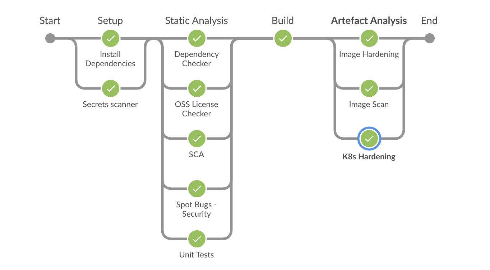
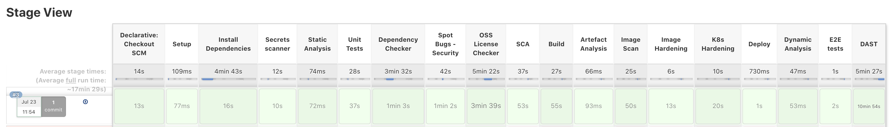
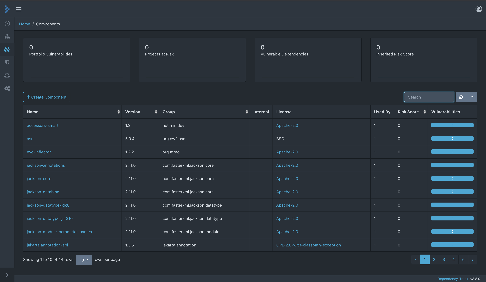

# Secure Pipelines Demo

Sample spring application with Jenkins pipeline script to demonstrate secure pipelines

## Pre Requesites

- minikube v1.18.1 - [Refer here for installation](https://kubernetes.io/docs/tasks/tools/install-minikube/)
- helm v3.5.3 - [Refer here for installation](https://helm.sh/docs/intro/install/)

## Setup Setps

### Minikube setup

- Setup minikube
  ```s
  minikube start --nodes=1 --cpus=4 --memory 8192 --disk-size=35g --embed-certs=true --driver=hyperkit
  ```

### Jenkins setup

- Stup Jenkins server

  ```s
  helm repo add jenkins https://charts.jenkins.io
  helm repo update
  helm install jenkins jenkins/jenkins
  ```

- Wait for the jenkins pod to start
- Get admin user password of Jenkins

  ```s
    kubectl exec --namespace default -it svc/jenkins -c jenkins -- /bin/cat /run/secrets/chart-admin-password && echo
  ```

  **Note:** Make a note of the password

- [Optional] Forward Jenkins server port to access from local machine

  ```s
  kubectl port-forward svc/jenkins 8080:8080
  open http://localhost:8080
  ```

- Add additonal plugins to Jeninks server (Manage Jenkins -> Manage plugins)

  - BlueOcean
  - Configuration as Code
  - OWASP Dependency-Track

### Dependency Track setup

- Refer [Dependency Track v4 Installation Guide](DEPENDENCY_TRACK.md)

  **Note:** dependency-track will take some time to start (~1hr on low end Mac)

### Link Jenkins and Dependency Track

- Login to Dependency track -> Administration -> Access Management -> Teams -> Click on Automation -> Copy the API Keys -> Also add the Permissions - PROJECT_CREATION_UPLOAD, POLICY_VIOLATION_ANALYSIS, VULNERABILITY_ANALYSIS

- Login to Jenkins -> Manage Jenkins -> Configure System -> Scroll to bottom -> Configure the Dependency-Track URL and API key -> Also enable Auto Create Projects -> Test Connection -> Save

Hint: URL (if you have followed the exact steps) http://dependency-track-apiserver.dependency-track.svc.cluster.local

### New Jenkins Pipeline

Create a new Jenkins pipeline with this repo and trigger build

- Login to Jenkins -> New Item -> Enter name and choose Pipeline -> Choose GitHub project and set project URL
- Under pipeline section, Choose Pipeline script from SCM
- Choose git as SCM and provide repo details
- Save

# Pipeline

Refer the below screenshot for the stages in the pipeline

##### Pipeline View



##### Stage View



##### Dependency Track



## Tools

| Stage               | Tool                                                                      |
| ------------------- | ------------------------------------------------------------------------- |
| Secrets Scanner     | [truffleHog](https://github.com/dxa4481/truffleHog)                       |
| Dependency Checker  | [OWASP Dependency checker](https://jeremylong.github.io/DependencyCheck/) |
| SAST                | [OWASP Find Security Bugs](https://find-sec-bugs.github.io/)              |
| OSS License Checker | [LicenseFinder](https://github.com/pivotal/LicenseFinder)                 |
| SCA                 | [Dependency Track](https://dependencytrack.org/)                          |
| Image Scanner       | [Trivy](https://github.com/aquasecurity/trivy)                            |
| Image Hardening     | [Dockle](https://github.com/goodwithtech/dockle)                          |
| K8s Hardening       | [KubeSec](https://kubesec.io/)                                            |
| IaC Hardening       | [checkov](https://www.checkov.io/)                                        |
| DAST                | [OWASP Baseline Scan](https://www.zaproxy.org/docs/docker/baseline-scan/) |

---

### TODO

Image Malware scanning - [ClamAV](https://github.com/openbridge/clamav)
